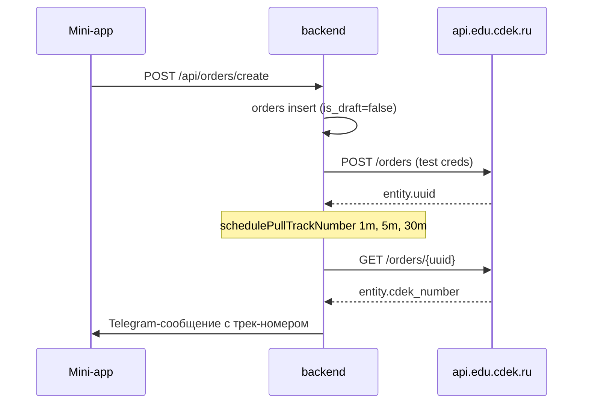

# MURU Mini App

Telegram Mini App for MURU Home Design with a React + TypeScript frontend and an Express + TypeScript backend.

## Project Structure

```text
frontend/   React + Vite + Telegram Mini Apps SDK
backend/    Express API
shared/     Shared modules (reserved)
```

## Prerequisites

- Node.js 20+
- npm 10+

## Environment

Copy `.env.example` to `.env` and fill values:

- `VITE_ADMIN_IDS` - comma-separated Telegram user IDs with admin access in frontend profile.
- `VITE_API_BASE_URL` - backend URL for admin sync requests.
- `PORT` - backend port.
- `ADMIN_TELEGRAM_IDS` - comma-separated Telegram user IDs allowed to run `/api/admin/sync`.
- `DATABASE_URL` - PostgreSQL connection string.
- `GOOGLE_SERVICE_ACCOUNT_EMAIL` and `GOOGLE_PRIVATE_KEY` - service account credentials.
- `CATALOG_SOURCE` - `xlsx` (default): read client **.xlsx** from Drive; `sheets`: legacy Google Sheets API.
- `GOOGLE_CATALOG_FILE_ID` - Drive file ID of the product registry xlsx ([MURU реестр заполнения товаров](https://docs.google.com/spreadsheets/d/13R05JyBIJsMl0fE7qQRxG1nVcKTU3XFg/edit) → `13R05JyBIJsMl0fE7qQRxG1nVcKTU3XFg`).
- `GOOGLE_CATALOG_XLSX_SHEET_NAME` - optional worksheet name inside the xlsx; if empty, the first sheet with an «артикул» header row is used.
- `ENABLE_SHEETS_STOCK_WRITE` - `false` for `CATALOG_SOURCE=xlsx` (no stock write-back to spreadsheet on orders; stock updates on full catalog sync only). Set `true` with `CATALOG_SOURCE=sheets` to restore Sheets stock deduction.
- `GOOGLE_SHEET_ID` - used only when `CATALOG_SOURCE=sheets`.
- `GOOGLE_DRIVE_FOLDER_ID` - root Drive folder for product photos ([пример](https://drive.google.com/drive/u/0/folders/1okABaQzSC-f9H6epKfhMH8sIImE2gLcQ)): раздел → … → товар → **Обрезанные** → **Главное фото** (`MUxxxx_1_O.*`) и **Доп фото** (`MUxxxx_2_O.*`, `MUxxxx_3_O.*`). В корне дерева — `muru_placeholder_600.webp`. В каталог попадают слоты **1** и **2**; legacy `MUxxxx-1.webp` в любой папке тоже поддерживается.

## Google Access Setup

1. Create a Google Cloud service account and enable **Google Drive API** (and **Google Sheets API** only if `CATALOG_SOURCE=sheets`).
2. Share the client **registry .xlsx** on Drive and the **root photo folder** with `GOOGLE_SERVICE_ACCOUNT_EMAIL` (**Reader** on xlsx is enough; **Editor** on the photo folder for public image links).
3. Put credentials into `.env` (`CATALOG_SOURCE=xlsx`, `GOOGLE_CATALOG_FILE_ID=…`, `ENABLE_SHEETS_STOCK_WRITE=false`).
4. After changing catalog file or env, run `pm2 reload ecosystem.config.js --update-env` on the server and run a full catalog sync in admin.

## Database Schema

Run SQL schema before first sync:

```bash
psql "$DATABASE_URL" -f backend/src/db/schema.sql
```

Повторный запуск этого файла безопасно добавит недостающие объекты (в т.ч. колонки обложек категорий `cover_drive_filename` / `cover_image_url`, если их ещё нет).

Если после деплоя в админке ошибка `column "cover_drive_filename" does not exist`, примените только миграцию колонок к **той же** базе, что в `DATABASE_URL` у backend:

```bash
psql "$DATABASE_URL" -f backend/src/db/migrations/001_category_cover_columns.sql
```

CDEK (после `005_promo_codes.sql`):

```bash
psql "$DATABASE_URL" -f backend/src/db/migrations/006_cdek_orders.sql
psql "$DATABASE_URL" -f backend/src/db/migrations/007_product_shipping_dims.sql
psql "$DATABASE_URL" -f backend/src/db/migrations/008_product_dims_parsed.sql
psql "$DATABASE_URL" -f backend/src/db/migrations/009_order_consent.sql
psql "$DATABASE_URL" -f backend/src/db/migrations/010_payments.sql
psql "$DATABASE_URL" -f backend/src/db/migrations/011_product_discount.sql
```

### ЮKassa (оплата до заказа)

В `.env`: `YOOKASSA_SHOP_ID`, `YOOKASSA_SECRET_KEY` (тест: `test_…`), `YOOKASSA_RETURN_URL`, `YOOKASSA_VAT_CODE=1`.

**Native Telegram Payments (основной checkout):** `TELEGRAM_BOT_TOKEN` + `TELEGRAM_PROVIDER_TOKEN` (BotFather → Payments → YooKassa). Кнопка «Перейти к оплате» вызывает `POST /api/payments/invoice`, затем `Telegram.WebApp.openInvoice` — оплата внутри mini app без браузера. Бот (long-polling) обрабатывает `pre_checkout_query` и `successful_payment`, создаёт заказ через `fulfillPaidIntent`. При `paid` корзина очищается и открываются «Мои заказы».

**Redirect fallback:** если `openInvoice` недоступен — `POST /api/payments/create` + `openLink`. Return URL (тест): `https://murushop.online/?pay=check` (`sessionStorage` `muru-pending-payment`, экран проверки). Прод — deep-link `https://t.me/<bot>/<app>?startapp=pay`.

Webhook в личном кабинете ЮKassa (тест): URL `https://murushop.online/yookassa-webhook`, события `payment.succeeded` и `payment.canceled`. Nginx: эталонный конфиг [`deploy/nginx-murushop.online.conf`](deploy/nginx-murushop.online.conf) (включает `/yookassa-webhook`). На VPS после `git pull`: `sudo bash deploy/sync-nginx-murushop.sh` — бэкап старого конфига, `nginx -t`, reload. Проверка: `curl -X POST https://murushop.online/yookassa-webhook` → **200**, не 405. Backend: `app.set('trust proxy', 1)` и маршрут до CORS.

После успешной оплаты webhook создаёт заказ из `payments.checkout_snapshot`, запускает СДЭК (если в снимке есть тариф/город) и шлёт уведомления в Telegram. Клиент поллит `GET /api/payments/:paymentId/status` на экране проверки; при `succeeded` корзина очищается и открываются «Мои заказы».

После синка каталога габариты и оценочный вес заполняются из колонки «Размер» и «Материал» в xlsx. Ручные правки не перезаписываются, если выставить `dims_source='manual'` и/или `weight_source='manual'`:

```sql
UPDATE products
SET dim_length_cm=35, dim_width_cm=35, dim_height_cm=40, weight_grams=1200,
    dims_source='manual', weight_source='manual'
WHERE sku = 'MU0123';
```

Проверка после синка:

```sql
SELECT sku, dimensions_label, dim_length_cm, dim_width_cm, dim_height_cm, weight_grams, color, color_tags
FROM products WHERE sku IN ('MU0001', 'MU0002') LIMIT 5;

SELECT COUNT(*) FILTER (WHERE dim_length_cm = 20 AND dim_width_cm = 20 AND dim_height_cm = 20) AS still_default,
       COUNT(*) AS total FROM products;
```

Диагностика СДЭК на VPS: временно `LOG_CDEK_DEBUG=1` в `.env`, затем `pm2 reload ecosystem.config.js --update-env` и `pm2 logs muru-backend --raw`. Список доступных тарифов для города: `curl 'https://murushop.online/api/cdek/tariff-list?toCityCode=137&weight=500'`. Для отправки со склада: `CDEK_TARIFF_DOOR=137` (склад→дверь), `CDEK_TARIFF_PVZ=136` (склад→ПВЗ); коды 138/139 дают `v2_internal_error`, если отправитель не «с двери».

### Подсказки адреса (DaData)

Подсказки улицы/дома работают через прокси `GET /api/cdek/address-suggest?q=...&city=...` к DaData. Нужен `DADATA_API_KEY` в `.env` (free 10k req/день, https://dadata.ru). Без ключа поле адреса остаётся ручным — никаких ошибок не будет.

Проверка после деплоя: `curl 'https://murushop.online/api/cdek/address-suggest?q=Невский&city=Санкт-Петербург'` — массив подсказок с полем `value` (готовая строка для CDEK).

### Тестирование заказа на тестовых ключах CDEK



Пошаговая проверка на песочнице:

1. В `.env` на VPS: `CDEK_ENV=test`, тестовые `CDEK_CLIENT_ID`/`CDEK_CLIENT_SECRET`, отправитель `CDEK_SENDER_CITY_CODE=137`, `CDEK_SENDER_ADDRESS="Ординарная 16, кв 104, г. Санкт-Петербург"`, `CDEK_SENDER_NAME`, `CDEK_SENDER_PHONE`. Тарифы `CDEK_TARIFF_DOOR=137`, `CDEK_TARIFF_PVZ=136`. `DADATA_API_KEY=<токен>`. Временно `LOG_CDEK_DEBUG=1`.
2. `pm2 reload ecosystem.config.js --update-env`.
3. Health-check: `curl https://murushop.online/api/cdek/health` → `status=ok`.
4. `curl 'https://murushop.online/api/cdek/tariff-list?toCityCode=137&weight=500'` — в списке должны быть 137 и 136.
5. `curl 'https://murushop.online/api/cdek/address-suggest?q=Невский&city=Санкт-Петербург'` — массив подсказок.
6. Через мини-апп оформить два заказа (door и ПВЗ): добавить товар → выбрать СПб → выбрать улицу/ПВЗ → корректный телефон `+7…`. В логах `pm2 logs muru-backend --raw` ожидаем `[cdek-orders] cdek order created { orderId, uuid }`.
7. Проверка в БД:
   ```sql
   SELECT id, cdek_sync_state, cdek_uuid, cdek_track_number, cdek_create_error
   FROM orders ORDER BY id DESC LIMIT 5;
   ```
   `cdek_sync_state='created'`, через 1–6 минут — заполнен `cdek_track_number`.
8. Проверка в СДЭК:
   ```bash
   TOKEN=$(curl -s -X POST 'https://api.edu.cdek.ru/v2/oauth/token?parameters' \
     -d "grant_type=client_credentials&client_id=$CDEK_CLIENT_ID&client_secret=$CDEK_CLIENT_SECRET" \
     | jq -r .access_token)
   curl -s "https://api.edu.cdek.ru/v2/orders/$UUID" \
     -H "Authorization: Bearer $TOKEN" | jq .entity.statuses
   ```
9. Negative-сценарии: город не найден → пустая подсказка в UI; невалидный телефон → `cdek_create_error` в БД + уведомление админам в Telegram; недоступный вес → читаемая ошибка в чекауте.
10. Чистка тестовых заказов:
    ```bash
    curl -X DELETE "https://api.edu.cdek.ru/v2/orders/$UUID" -H "Authorization: Bearer $TOKEN"
    ```
11. После окончания диагностики убрать `LOG_CDEK_DEBUG=1` и `pm2 reload`.

Проверка: `psql "$DATABASE_URL" -c "\d categories"` — в списке колонок должны быть `cover_drive_filename` и `cover_image_url`.

## Run Frontend

```bash
cd frontend
npm install
npm run dev
```

## Run Backend

```bash
cd backend
npm install
npm run dev
```

## Build

```bash
cd frontend && npm run build
cd backend && npm run build
```

## Деплой на Beget VPS

### Подготовка
1. VPS: Ubuntu 22.04, 2 vCPU, 2GB RAM
2. Домен: настрой A-запись на IP сервера
3. Nginx + Let's Encrypt SSL

### Деплой backend
```bash
git clone https://github.com/your/repo.git /var/www/muru
cd /var/www/muru
cp .env.example .env
# Заполни .env реальными значениями
cd backend && npm ci && NODE_OPTIONS=--max-old-space-size=2048 npm run build && npm ci --omit=dev && cd ..
pm2 start ecosystem.config.js
pm2 save
pm2 startup
```

### Деплой frontend
```bash
cd frontend && npm install && npm run build
# dist/ загружать на Vercel или отдавать через nginx
```

### Обновление
```bash
git pull origin main
bash deploy.sh
```

## Работа с Telegram-ботом и Mini App на VPS

Ниже практический runbook для сервера (пример текущего пути: `/var/www/muru`).

### 1) Подготовка `.env` на VPS

В файле `.env` на сервере обязательно проверь:

- `TELEGRAM_BOT_TOKEN` - токен бота из BotFather.
- `TELEGRAM_MINI_APP_URL` - публичный **HTTPS** URL Mini App для кнопок `web_app` в меню бота (например, `https://murushop.online`). Не используй `t.me/...` — Telegram откроет Mini App только с прямым HTTPS URL.
- `BOT_WELCOME_DESCRIPTION` - текст профиля бота до кнопки СТАРТ (backend вызывает `setMyDescription` при старте).
- `BOT_WELCOME_MESSAGE` - подпись к фото после `/start` (по умолчанию зашит в код).
- `BOT_SITE_URL`, `BOT_CHANNEL_URL`, `BOT_CARE_URL`, `BOT_DELIVERY_URL` - внешние кнопки в inline-меню после `/start`.
- `VITE_API_BASE_URL` - публичный backend URL (если frontend ходит не на same-origin).
- `VITE_ADMIN_IDS`, `ADMIN_TELEGRAM_IDS` - Telegram ID админов.
- `ORDER_NOTIFY_TELEGRAM_IDS` - Telegram ID для уведомлений по заказам.
- `DATABASE_URL`, `JWT_SECRET`, Google (`GOOGLE_*`) - обязательные backend-переменные.

Если переменные менялись, перезапускать backend нужно с `--update-env`.

### 2) Настройка бота в BotFather

1. Открой `@BotFather`.
2. Командой `/mybots` выбери нужного бота.
3. `Bot Settings` -> `Menu Button` -> задай URL Mini App (`https://...`).
4. Проверь, что URL публичный и с валидным SSL (Telegram требует HTTPS).
5. Описание до СТАРТ backend выставляет через Bot API (`setMyDescription` / `setMyShortDescription`). При желании сверь в BotFather: `Edit Bot` -> `Edit Description` — текст должен совпадать с `BOT_WELCOME_DESCRIPTION`.
6. Картинка приветствия после `/start` — в админке Mini App: **Настройки** -> имя файла на Google Drive (как обложки категорий). Миграция: `psql "$DATABASE_URL" -f backend/src/db/migrations/004_bot_welcome_settings.sql`.
7. После `/start` бот шлёт фото (если URL резолвится) + текст + inline-клавиатуру (каталог, корзина `?tab=cart`, избранное `?tab=favorites`, внешние ссылки из `BOT_*_URL`).

### 3) Деплой на VPS (backend + frontend)

```bash
cd /var/www/muru
git pull

# Backend: полный install -> build -> production deps
cd backend
npm ci
NODE_OPTIONS=--max-old-space-size=2048 npm run build
npm ci --omit=dev

# Frontend
cd ../frontend
npm install
npm run build

# PM2 запускать из корня проекта (где ecosystem.config.js)
cd ..
pm2 start ecosystem.config.js --update-env || pm2 reload ecosystem.config.js --update-env
pm2 save
```

Примечание: для `frontend` используется `npm install`, так как в проекте может отсутствовать `frontend/package-lock.json`.  
`npm ci` без lock-файла завершится ошибкой `EUSAGE`.

### 4) Проверка после деплоя

```bash
pm2 status
pm2 logs --lines 100
curl -sS http://127.0.0.1:4000/api/health
```

Проверить вручную:

- `https://murushop.online` открывается.
- Mini App открывается из Telegram через кнопку бота.
- Новый чат с ботом: видно description и СТАРТ; `/start` — приветствие и 6 рядов кнопок; «Корзина» / «Избранное» открывают Mini App на нужной вкладке.
- Вкладка `Профиль` -> `Админ` видна только для ID из `VITE_ADMIN_IDS`.
- Создание заказа отправляет уведомления на `ORDER_NOTIFY_TELEGRAM_IDS`.

### 5) Image proxy (`/img/`)

Каталог отдаёт картинки через backend (sharp + дисковый кэш), не напрямую с Google Drive.

```bash
mkdir -p /var/www/muru/cache/img
# пользователь, под которым крутится pm2 (часто root на VPS):
chown -R "$(whoami)" /var/www/muru/cache
```

В `.env`: `IMAGE_CACHE_DIR=/var/www/muru/cache/img` (см. `.env.example`).

Nginx: см. [`deploy/nginx-img-cache.snippet`](deploy/nginx-img-cache.snippet) — `proxy_cache_path` в `http {}` и `location /img/` рядом с `/api/`.

После синка каталога кэш для затронутых Drive file id сбрасывается автоматически. Ручной сброс: `POST /api/admin/images/invalidate` body `{ "fileIds": ["..."] }`.

### 6) Частые проблемы на VPS

- `sh: 1: tsc: not found` - выполнен `npm ci --omit=dev` до сборки.  
  Решение: `npm ci` -> `npm run build` -> `npm ci --omit=dev`.
- `npm ci` в `frontend` падает с `EUSAGE`.  
  Решение: использовать `npm install` или добавить `frontend/package-lock.json` в репозиторий.
- `FATAL ERROR: ... heap out of memory` на backend build.  
  Решение: `NODE_OPTIONS=--max-old-space-size=2048 npm run build` (или 3072).
- `[PM2][ERROR] File ecosystem.config.js not found`.  
  Решение: запускать `pm2 ... ecosystem.config.js` из `/var/www/muru`.
- `curl 127.0.0.1:4000` не отвечает.  
  Решение: проверить `pm2 status`, `pm2 logs`, корректность `.env`.
- В админке «Сервер временно недоступен» при синхронизации, а `curl` на `127.0.0.1:4000` успешен.  
  Решение: увеличить таймаут nginx для API (полный синк может занимать 1–3 мин):

```nginx
location /api/ {
  proxy_pass http://127.0.0.1:4000;
  proxy_read_timeout 300s;
  proxy_connect_timeout 60s;
}
```

Проверка синка напрямую (минуя nginx):

```bash
curl --max-time 600 -X POST http://127.0.0.1:4000/api/admin/sync \
  -H "x-telegram-user-id: YOUR_ADMIN_ID" \
  -H "Content-Type: application/json" \
  -d '{"telegramUserId": YOUR_ADMIN_ID}'
```

В `pm2 logs` после успешного синка ожидайте `withMain` > 0 и отсутствие предупреждения про `muru_placeholder_600.webp` (если файл в корне Drive).
- Нет уведомлений в Telegram.  
  Решение: проверить `TELEGRAM_BOT_TOKEN` и `ORDER_NOTIFY_TELEGRAM_IDS`.

## Admin Sync Endpoint

- `POST /api/admin/sync` — запускает синк в фоне, ответ **202** `{ accepted: true }` (не ждёт 3–5 мин).
- `GET /api/admin/sync/status` — статус job каталога: `idle` | `running` | `success` | `error` и `result` после успеха.
- `POST /api/admin/sync/category-covers` — фоновая синхронизация обложек разделов, ответ **202**; `GET /api/admin/sync/category-covers/status` — прогресс (`progress.message`) и итог.
- Auth: header `x-telegram-user-id` (или body `telegramUserId`) в `ADMIN_TELEGRAM_IDS`.
- Sync behavior:
  - reads products from Google Sheets,
  - recursively scans Drive tree (`MUxxxx_1_O` / `_2_O` / `_3_O` in **Главное фото** / **Доп фото**, legacy `MUxxxx-N.webp`),
  - сохраняет до **3** URL в `image_urls` (карусель: главное + 2 доп.),
  - publishes matched files and upserts products/categories/variants into PostgreSQL.

## Как запустить админку

1. В `.env` укажи админские Telegram ID:
   - `VITE_ADMIN_IDS` для фронтенда,
   - `ADMIN_TELEGRAM_IDS` для бэкенда.
2. Запусти backend:
   - `cd backend`
   - `npm install`
   - `npm run dev`
3. Запусти frontend:
   - `cd frontend`
   - `npm install`
   - `npm run dev`
4. Открой Mini App, перейди в вкладку `Профиль` и нажми `Админ`.
5. На странице `AdminDashboard` используй кнопки:
   - `Синхронизировать каталог` для запуска `POST /api/admin/sync`,
   - `Обновить` для повторного запуска синхронизации и обновления статуса/лога.

## Как работает оформление заказа

- Корзина находится во вкладке `Корзина` в Mini App.
- Данные корзины и формы checkout сохраняются как серверный черновик через:
  - `GET /api/orders/draft/:telegramUserId`
  - `POST /api/orders/draft/save`
- Подтверждение заказа выполняется через:
  - `POST /api/orders/create`
- Заказ сохраняется в PostgreSQL со статусом `Черновик`.
- После создания:
  - клиент получает номер заказа и сообщение `Заказ принят. Ожидайте звонка менеджера`;
  - backend отправляет уведомления Telegram-админам через Telegram Bot API;
  - email-уведомление на `Muru_online@mail.ru` пока работает в режиме `console.log` заглушки.

### Запуск checkout flow локально

1. Применить схему БД (включая `orders` и `order_items`):
   - `psql "$DATABASE_URL" -f backend/src/db/schema.sql`
2. Поднять backend:
   - `cd backend`
   - `npm install`
   - `npm run dev`
3. Поднять frontend:
   - `cd frontend`
   - `npm install`
   - `npm run dev`
4. Открыть Mini App:
   - добавить товары в корзину,
   - перейти к `Оформить заказ`,
   - выбрать `Доставка` или `Самовывоз`,
   - нажать `Подтвердить заказ`.

## Что уже работает

- Каталог: дерево категорий, листинг товаров, поиск/фильтрация, карточка товара и детальная страница.
- Корзина и checkout: добавление товаров, изменение количества, удаление, промокод (mock), выбор доставки/самовывоза, CDEK mock-варианты.
- Заказы: создание заказа в PostgreSQL со статусом `Черновик`, сохранение `order_items`, просмотр истории заказов в профиле.
- Профиль: редактирование ФИО/телефона/адреса, блок с персональными данными, базовые меню-элементы аккаунта.
- Избранное: добавление/удаление из детальной страницы, хранение в БД, пустое состояние с CTA.
- Под заказ: для `inStock = 0` показывается статус `Под заказ` и CTA `Сообщить о поступлении`.
- Уведомления о поступлении: `POST /api/catalog/restock-notify` и отправка админам через Telegram Bot API.
- Админка и синхронизация: `AdminDashboard`, запуск `POST /api/admin/sync`, статус/лог/метрики синка, проверка доступа по Telegram ID.
- UX-полиш: унифицированные empty states, loading skeletons, Telegram BackButton на внутренних экранах.
- MVP готов к ручному тестированию end-to-end сценариев.

## Чек-лист тестирования MVP

- [ ] Запуск фронта + бэка
- [ ] Синхронизация в админке (проверить фото по MUxxxx-1/2)
- [ ] Каталог → карточка → детальная страница
- [ ] Добавление в корзину + изменение количества
- [ ] Оформление заказа (адрес, CDEK, промокод)
- [ ] Создание заказа + уведомление в консоль
- [ ] «Под заказ» + кнопка «Сообщить о поступлении»
- [ ] Профиль + Избранное (пустое состояние)
- [ ] Админ-доступ по Telegram ID
